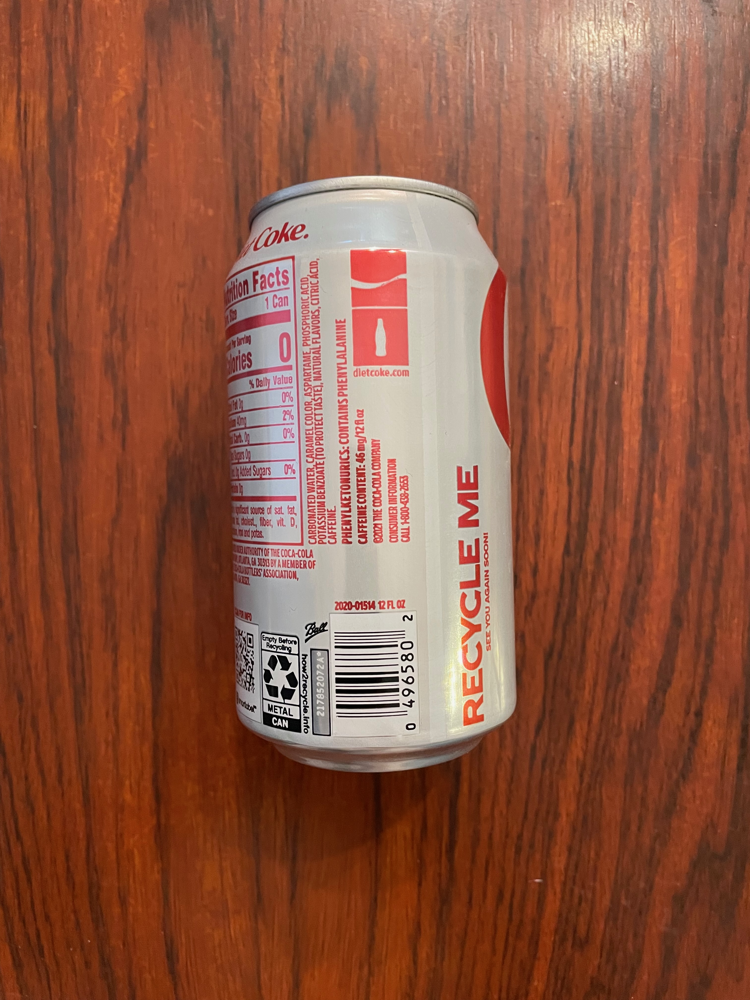
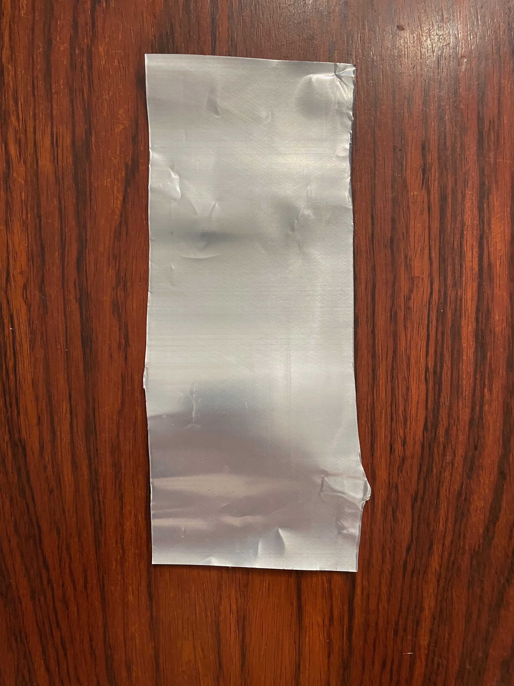
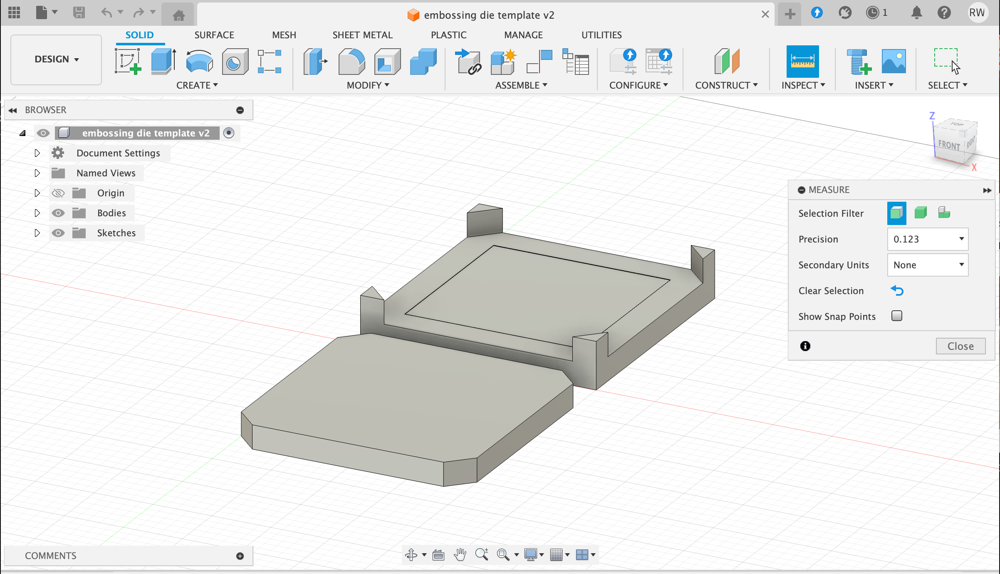
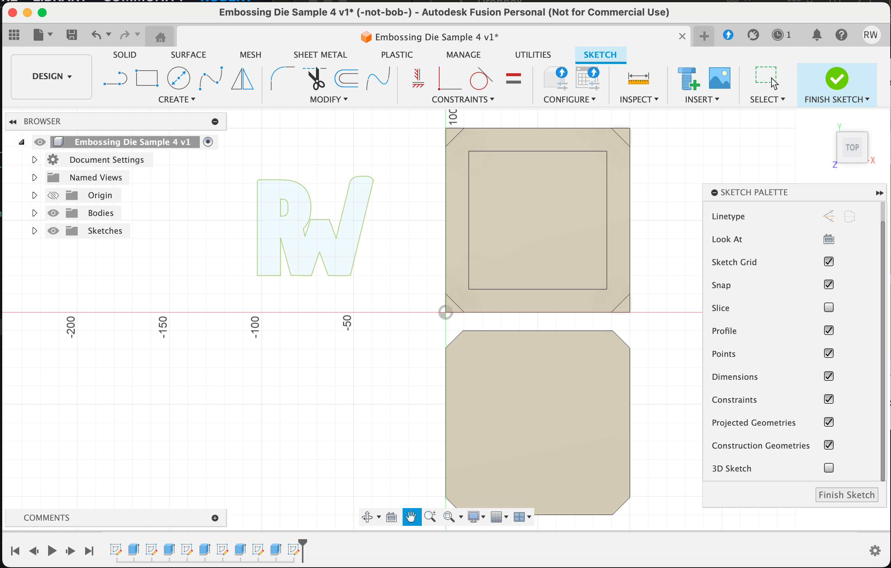
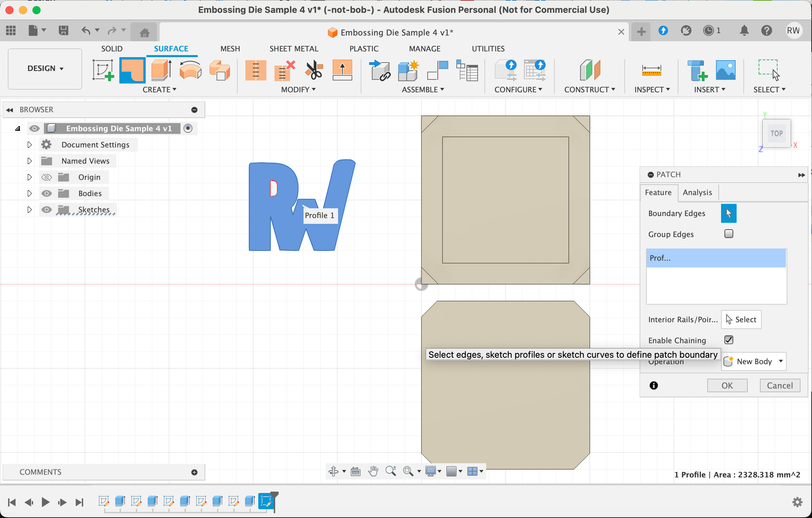
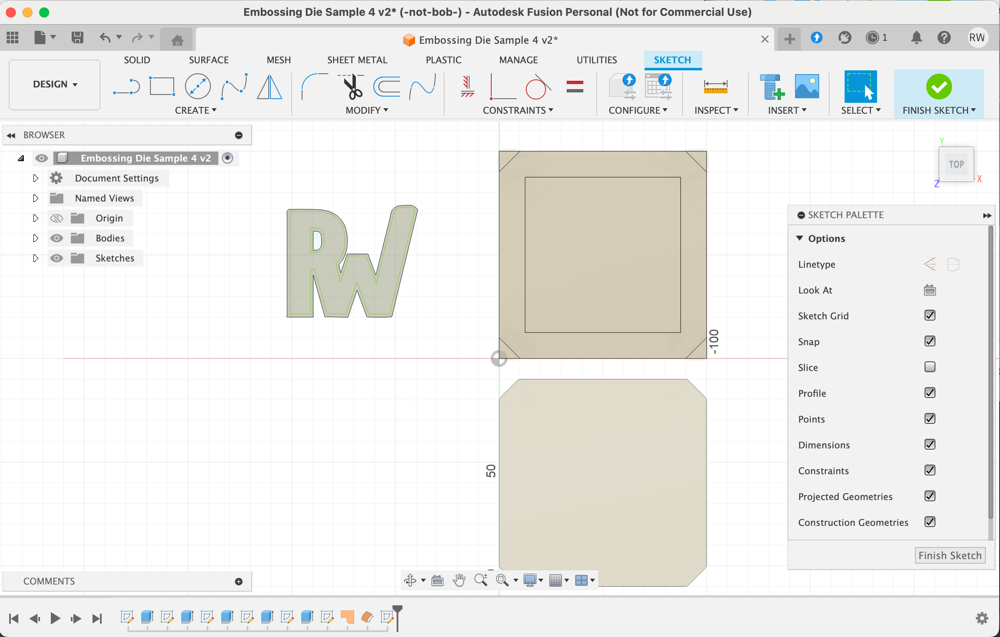

# Embossing thin aluminum using a 3D-printed die

## Goal
I'd like to establish a process to take the aluminum from aluminum cans and emboss shapes into them using a 3D printed die designed in Autocad Fusion 360.

## Challenges
The chamfer tool I wanted to use has limitations. The 'loft' tool can be used to produce a suitable outcome.

## Materials
I'm using a 'standard' 123mm x 66mm soda can.

Then I remove the top and bottom (using [this model](https://www.thingiverse.com/thing:3658526)) and end up with a roughly 90mm x 235mm x 0.15 mm sheet of metal.
NOTE:The actual thickness of the walls of cans varies between 0.1mm and 0.2mm. I'm assuming a 0.15mm wall thickness.

## Starting Point
I created a 'blank' die that has a 75mm x 75mm x 0.165mm blank set in the base to allow for a 75mm square of aluminum. The depth is my assumed 0.15 mm + a 10% variance. The 10% comes from someone on the internet, which must make it true.

## Embossing a flat design
I've got several SVGs lying around. I'll use this one.

That image is the one I want to be emossed at the surface. Because Fusion does not like using the chamfer tool on complex surfaces, I'll use the loft function to create the shape I want. In order to do that, I need the 'bottom' shape for the embossing. I used Inkscape to make the 'bottom' part. I took the original SVG and use the Path>Outset several times to get the desired shape.
 

I'll go back to Fusion and import the 'bottom' piece first and size it the way I want.

Then I select all the SVG items and then use the Surface>Create>Patch feature to make a surface.

I then select Surface>Create>Offset and select the surface. Then set the offset to be 1mm (you can make this as big as you want, but I'm starting here). The import the original SVG on the offset.

(this will need to be done letter-by-letter)

